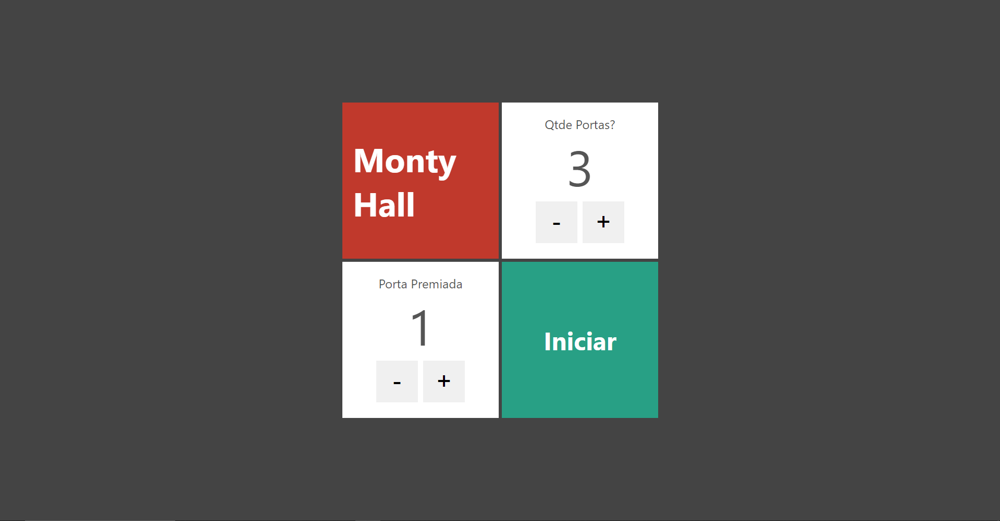
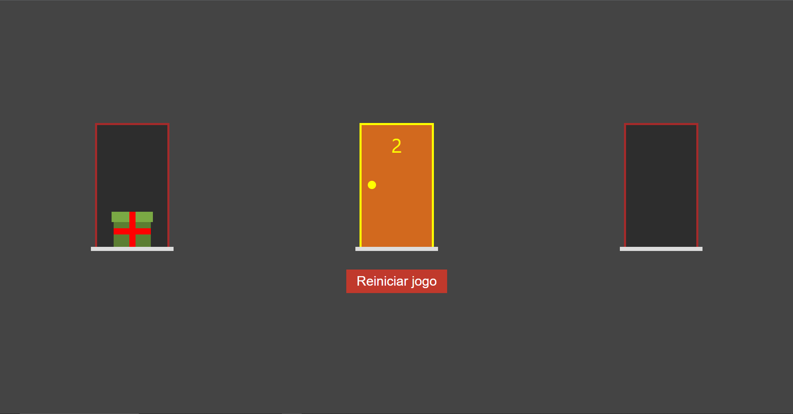

    <h1>Problema de MontyHall utilizando Next.Js e TypeScript</h1>

  

  

## Sobre
A aplicação representa o problema de MontyHall onde um participante escolhe entre várias portas, uma das quais esconde um prêmio. Após a escolha inicial, o apresentador revela algumas das portas que não contém o prêmio e pergunta se o participante deseja trocar de porta. Trocar de porta, em vez de manter a escolha original, aumenta suas chances de ganhar o prêmio, independentemente do número de portas, pois a probabilidade de sucesso aumenta ao fazer a troca.

## Tecnologias utilizadas
* Next 13.5.4
* React ^18
* Typescript 5.2.2

## Link da aplicação

<!--  -->
Em breve

## Para executar

1. `git clone https://github.com/davirsreis/montyHall-next-ts.git`
2. `cd montyHall-next-ts`
3. `npm install`
4. `npm run dev`